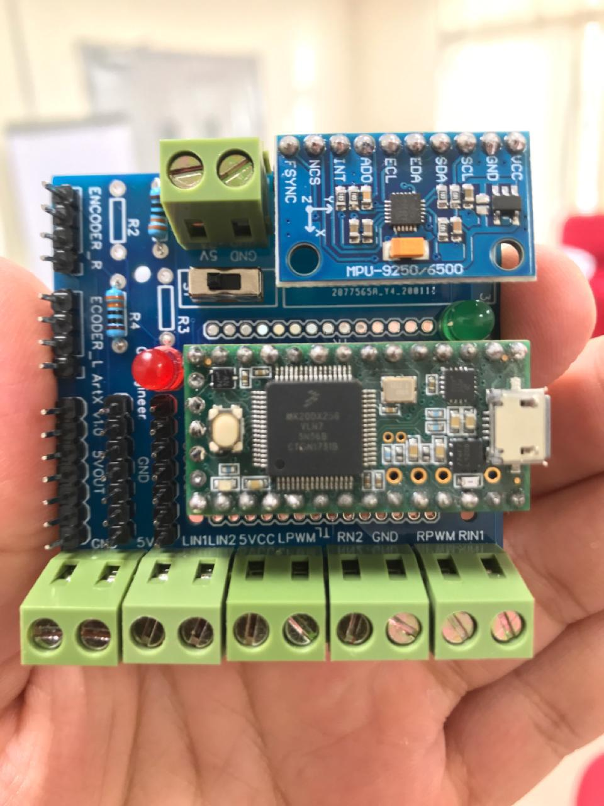
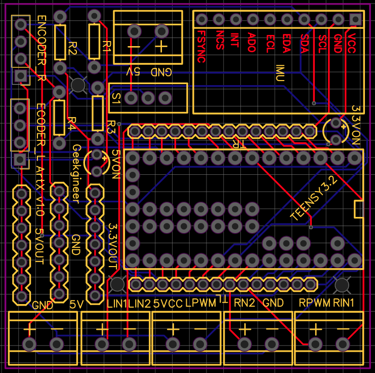
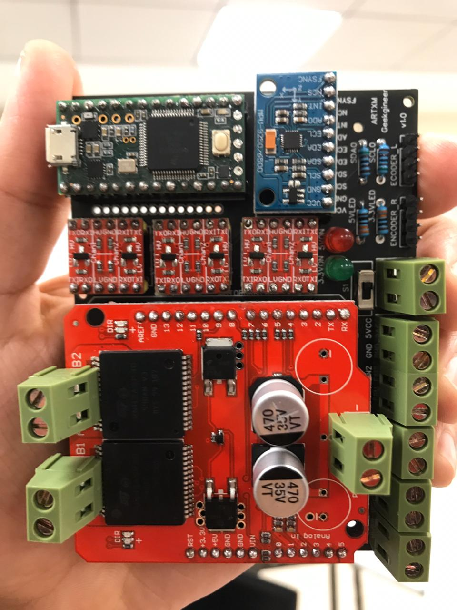
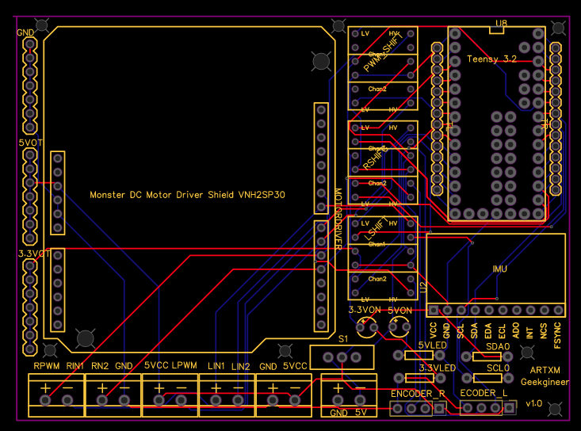

# Betabot Embedded Controller

Custom PCB to be the core embedded board of the robot, it has Teensy 3.2/4, MPU6050/9250, Motor driver 14A, 5v two Encoders.
also bi-directional logic level converter [level shifter](https://www.antratek.com/logic-level-converter-bi-directional) used to handel the 3.3v and 5v in the board.

The board used 5V/1A as input and 12V/A for the Motor Shield integrated.

Components such as controller, IMU, motor driver are attached by 2.54mm pin female connectors on the PCB for modularity to aid future maintenance, ability to be swapped out if required.

> One solution to interface with robot main on board computing board RPI/ Nvidia Jetson series /Intel NUC using USB cable.


## ARTX1 Embedded Controller





See the [schematic](artx1/Schematic_artx1_Sheet.pdf) for more details on wiring and pins out.

## ARTXM Embedded Controller

Main difference from ARTX1 is a [VNH2SP30](https://www.sparkfun.com/products/10182) as motor driver, it was chosen as it could output an adequate average of 30A for two DC motors, and small footprint fit the PCB well. 





[Monster Moto Shield](https://github.com/sparkfun/Monster_Moto_Shield/tree/Hv12Fv10)

```
Voltage max: 16V
Maximum current rating: 30 A
Practical Continuous Current: 14 A
Current sensing available to Arduino analog pin
MOSFET on-resistance: 19 mΩ (per leg)
Maximum PWM frequency: 20 kHz
Thermal Shutdown
Undervoltage and Overvoltage shutdown
```
See the [schematic](artxM/Schematic_artxM_Sheet.pdf) for more details on wiring and pins out.

## Wiring Diagram

The the both boards uses the same below schematic.


Source: [Linorobot Base Controller](https://raw.githubusercontent.com/linorobot/lino_docs/master/schematics/v2/linorobot_2wdrev2_bb.png)


## Future development 

1. Add power protection 
2. Add DC-DC converter to work only on 12V input
3. Add More Sensors inputs
4. Add USB power OUT for RPLiDAR series
5. The Teensy 3.2 requires a USB cable to the onboard computing board. As a possibility to save on one USB cable, a ROS SPI node will be required, and some development to Teensy firmware. SPI pin connection was freed to be used later.


## Credits

Circuit was designed based on the Linorobot circuit founded [here](https://github.com/linorobot/linorobot/wiki/2.-Base-Controller).

and Lino board founded here[hear](https://github.com/Shine16/Linorobot-PCB)
